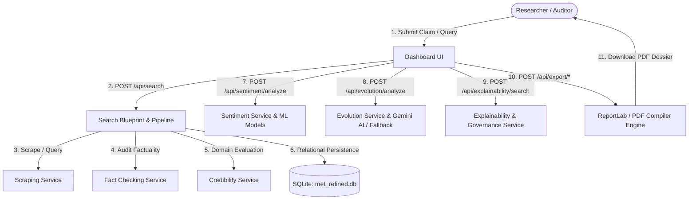
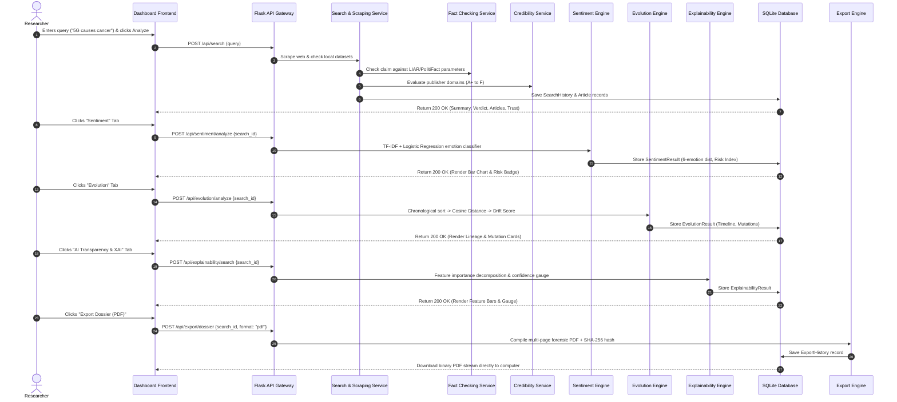
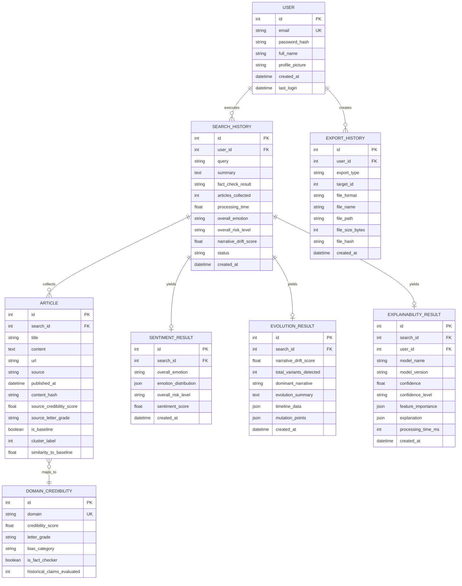

# MET Research Platform: Complete Technical, Architectural & Component Guide
**Misinformation Detection and Evolution Tracking System**
*A comprehensive technical, functional, and presentation guide for GitHub READMEs, college project vivas, and technical interviews.*

---

## Table of Contents

1. [Executive Summary & Abstract](#1-executive-summary--abstract)
2. [Why We Built This System (Problem Statement & Motivation)](#2-why-we-built-this-system)
3. [How It Is Different from Existing Systems](#3-how-it-is-different-from-existing-systems)
4. [Core Advantages & Innovations](#4-core-advantages--innovations)
5. [Technology Stack](#5-technology-stack)
6. [Tech Stack & Language Rationale](#6-tech-stack--language-rationale)
7. [Detailed System Workflow & Data Lifecycle](#7-detailed-system-workflow--data-lifecycle)
8. [Machine Learning Model Training, Logic, Accuracy & Datasets](#8-machine-learning-model-training-logic-accuracy--datasets)
9. [Libraries, Packages & Key Functions](#9-libraries-packages--key-functions)
10. [Project Directory & Core Files](#10-project-directory--core-files)
11. [Global Navigation & Layout (`base.html`)](#11-global-navigation--layout-basehtml)
12. [Page-by-Page & Component-by-Component Guide](#12-page-by-page--component-by-component-guide)
    - [Landing Page (`/`)](#landing-page---indexhtml)
    - [Authentication (`/login` & `/register`)](#authentication-pages---loginhtml--registerhtml)
    - [Main Dashboard Console (`/dashboard`)](#main-dashboard-console---dashboardhtml)
    - [Tab 1: Sentiment Intelligence](#tab-1-sentiment-intelligence)
    - [Tab 2: Narrative Evolution](#tab-2-narrative-evolution)
    - [Tab 3: AI Explainability (XAI) & Model Governance](#tab-3-ai-explainability-xai--model-governance)
    - [Search History Page (`/search-history`)](#search-history-page---search_historyhtml)
    - [System Overview & Developer Monitors (`/system-overview`)](#system-overview--developer-monitors---system_overviewhtml)
    - [About Platform (`/about-platform`)](#about-platform---about_platformhtml)
    - [User Profile (`/profile`)](#user-profile---profilehtml)
13. [Deep Dive into Every Chart & Graph](#13-deep-dive-into-every-chart--graph)
14. [Complete API Reference (27 Endpoints)](#14-complete-api-reference)
15. [Database Architecture, Schema & Cascade Rules](#15-database-architecture-schema--cascade-rules)
16. [Forensic PDF Dossier Generation](#16-forensic-pdf-dossier-generation)
17. [Glossary of Technical Terms (Layman's Definitions)](#17-glossary-of-technical-terms-laymans-definitions)
18. [Viva Examination & Interview Q&A Cheat Sheet](#18-viva-examination--interview-qa-cheat-sheet)
19. [File Reference Quick-Lookup Table](#19-file-reference-quick-lookup-table)

---

## 1. Executive Summary & Abstract

The **Misinformation Detection and Evolution Tracking (MET)** system is an enterprise-grade research and auditing platform engineered to analyze digital deception. Rather than treating misinformation as a static classification problem ("Real vs. Fake"), MET models misinformation as a dynamic, living narrative that changes phrasing, targets emotional vulnerabilities, and migrates across publishers over time.

MET integrates:
- **Fact-Checking Verification**: Audits claim veracity against gold-standard benchmarks.
- **Sentiment & Emotion Manipulation Analysis**: Quantifies emotional weaponization (e.g., weaponized fear, indignation, or artificial euphoria).
- **Narrative Evolution Tracking**: Maps the lineage of claims across time using TF-IDF cosine distance, detecting mutations and cumulative narrative drift.
- **Explainable AI (XAI)**: Provides token-level feature importance (LIME/SHAP logic) to make black-box ML decisions transparent.
- **Source Reliability Auditing**: Tracks historical publisher credibility and grades domains (A+ to F).
- **Forensic PDF Dossier Generation**: Exports formal, tamper-evident PDF dossiers equipped with SHA-256 integrity verification checksums.



---

## 2. Why We Built This System

### The Problem
1. **Misinformation is Not Static**: Traditional fact-checkers debunk a claim on Day 1. By Day 3, bad actors reword the headline, omit key context, and republish it to bypass static keyword filters.
2. **Binary Classifiers Fail**: Labeling news as merely "True" or "False" provides zero nuance. Real-world rumors often mix a grain of scientific truth with exaggerated conclusions ("Half-True" or "Misleading Context").
3. **Emotional Weaponization**: Fake news spreads 6 times faster than factual news on social media because it is engineered to evoke intense emotional reactions (fear, anger, disgust). Standard systems ignore emotional tone entirely.
4. **The "Black Box" Trust Deficit**: If an AI system labels a medical or political article as "Fake" without explanation, journalists and researchers cannot trust or defend the verdict.
5. **Lack of Evidence Preservation**: Digital pages disappear, tweets are deleted, and web articles get altered. Researchers need permanent, tamper-evident forensic records.

### The Objective
To build an open, explainable, end-to-end research ecosystem where an investigator can enter any claim or topic, observe its factual truth rating, see exactly which words influenced the AI, measure emotional manipulation, track how the story mutated from its baseline origin, and generate an archival PDF report.

---

## 3. How It Is Different from Existing Systems

| Dimension | Traditional Fact-Checkers (Snopes, PolitiFact) | Typical ML Fake News Detectors | MET Research Platform (Our System) |
| :--- | :--- | :--- | :--- |
| **Analysis Scope** | Manual human investigation (slow, days to weeks) | Binary text classification (`0` for Real, `1` for Fake) | **Multi-dimensional pipeline** (Fact Audit + Emotion + Lineage + XAI + Source Trust) |
| **Evolution Tracking** | None; single static review | None; classifies each post in isolation | **Chronological mutation trees & Narrative Drift Score (0–100)** |
| **Emotional Tone** | Not analyzed | Ignored | **6-class emotion distribution & Manipulation Risk Index (Low/Med/High)** |
| **Algorithmic Explainability**| Human justification | "Black Box" (output is just a score without explanation) | **Token-level feature importance (SHAP/LIME logic) with confidence gauge** |
| **Source Reputation** | Addressed ad-hoc in text | Ignored | **Automated domain scoring with historical tracking & letter grades (A+ to F)** |
| **Reporting & Archival** | Web article only | Raw JSON terminal output | **Forensic multi-page PDF research dossiers with SHA-256 hashes** |
| **Offline Resilience** | Requires internet access | Requires cloud API connection | **Local heuristic fallback & offline model inference** |

---

## 4. Core Advantages & Innovations

1. **Chronological Narrative Lineage**: Identifies the earliest verified reporting as a baseline, cluster-groups subsequent articles, and pinpoints exact mutation events (exaggeration, false attribution, out-of-context quotes).
2. **Algorithmic Transparency (XAI)**: Uses linear surrogate feature decomposition to highlight words supporting the prediction in emerald and words contradicting it in rose.
3. **Dual-Classifier Architecture**: Benchmarks Logistic Regression against Multinomial Naive Bayes across three distinct tasks (Fake News, Claim Credibility, and Emotion Recognition).
4. **Source Credibility Normalization**: Strips subdomains, normalizes URLs, references a curated trust database, and computes weighted domain averages.
5. **Session Isolation & Cascading Integrity**: Relational foreign-key cascading guarantees that if a search query is deleted, all associated articles, sentiment records, mutation trees, and XAI logs are purged without leaving orphaned data.
6. **Zero-Crash Fallback Design**: If the Gemini Generative AI API is unreachable or unconfigured, the system automatically switches to internal rule-based heuristic summaries without crashing.

---

## 5. Technology Stack

```
+-------------------------------------------------------------------------+
|                              PRESENTATION LAYER                         |
|   HTML5  |  Tailwind CSS (Dark/Light Engine)  |  Vanilla JS  |  Chart.js|
+-------------------------------------------------------------------------+
                                    | HTTP / REST + Bearer JWT
+-------------------------------------------------------------------------+
|                           APPLICATION GATEWAY                           |
|       Flask 3.0+ Application Factory  |  Flask-JWT-Extended Middleware  |
+-------------------------------------------------------------------------+
                                    |
+-------------------------------------------------------------------------+
|                              SERVICE LAYER                              |
| SearchService | FactCheckingService | SentimentService | EvolutionService|
| ExplainabilityService | CredibilityService | ScrapingService | ExportService|
+-------------------------------------------------------------------------+
            |                                           |
+-----------------------+                   +-----------------------------+
|    ML / NLP ENGINE    |                   |       PERSISTENCE LAYER     |
| Scikit-Learn | NLTK   |                   |  SQLite 3 (met_refined.db)  |
| spaCy | Joblib        |                   |  SQLAlchemy ORM             |
| Gemini Generative AI  |                   |  ReportLab / PDF Engine     |
+-----------------------+                   +-----------------------------+
```

- **Backend**: Python 3.12, Flask 3.0.2, Werkzeug 3.0.1
- **Database**: SQLite 3, Flask-SQLAlchemy 3.1.1, Flask-Migrate 4.0.7
- **Security**: Flask-JWT-Extended 4.6.0 (HMAC-SHA256 tokens), Werkzeug security password hashing
- **NLP & Machine Learning**: Scikit-Learn 1.4.1, NLTK 3.8.1, spaCy 3.7.4, NumPy 1.26.4, Pandas 2.2.1, Joblib 1.4.2
- **External AI**: Google Gemini Generative AI (`google-generativeai`)
- **Visualizations**: Chart.js 4.4, Matplotlib 3.8.3, Seaborn 0.13.2
- **PDF Compilation**: ReportLab 4.2.2, HTML/CSS print formatting
- **Web Scraping**: Requests 2.31.0, BeautifulSoup4 4.12.3, tldextract 5.1.0

---

## 6. Tech Stack & Language Rationale

### Why Python?
Python is the undisputed standard for Natural Language Processing and Machine Learning. Its ecosystem (Scikit-Learn, NLTK, spaCy, Pandas) allows machine learning training and web-service deployment to live in the exact same environment without cross-language serialization overhead.

### Why Flask over Django or FastAPI?
- **Django** is heavily opinionated and includes monolithic baggage (admin panels, heavy ORM defaults, session tables) that are unnecessary for a microservice-style research console.
- **FastAPI** is asynchronous and modern, but integrating synchronous scientific libraries (Scikit-Learn, ReportLab, Joblib) into an async event loop can create blocking bottlenecks.
- **Flask Application Factory** provides total architectural freedom: lightweight, explicit modularity via Blueprints, clean JWT integration, and predictable synchronous CPU-bound thread execution.

### Why SQLite with SQLAlchemy?
- **Zero-Setup Portability**: College project evaluations and research demonstrations require instant spin-up without requiring MySQL or PostgreSQL server daemons.
- **Foreign-Key Cascades**: SQLite supports robust relational constraints (`ON DELETE CASCADE`), ensuring research data integrity.
- **SQLAlchemy ORM**: Decouples business logic from SQL dialect. If the project is deployed to AWS/GCP, the connection string can be changed to PostgreSQL in `config.py` with zero code modifications.

### Why Vanilla JavaScript & Tailwind CSS over React/Vue?
- **Zero Build Step Complexity**: No `npm install`, Node.js version conflicts, Webpack/Vite bundlers, or hydration mismatches. The app loads instantly in any browser.
- **Micro-Interactions**: Direct DOM control with Chart.js allows precise destruction and redrawing of canvases when switching research tabs.
- **Tailwind CSS**: Enables modern glassmorphism, responsive flex layouts, and a native Dark Mode toggle through simple class manipulations (`dark:` variant).

### Why ReportLab for PDF Dossiers?
CSV and HTML exports are easily altered in text editors. ReportLab compiles true vector PDF documents with cryptographic checksums, custom color palettes, metadata headers, and pagination that can be legally submitted as documentary evidence.

---

## 7. Detailed System Workflow & Data Lifecycle



---

## 8. Machine Learning Model Training, Logic, Accuracy & Datasets

All models were trained using the standalone pipeline script: **[scripts/train_models.py](file:///c:/Users/laksh/workspace/Projects/Major%20project/MET/scripts/train_models.py)**.

### A. The Datasets Used

1. **Fake News Detection Dataset (`Fake News Detection/`)**:
   - Files: `True.csv` (21,417 real news articles) and `Fake.csv` (23,481 fake news articles).
   - Total records: **44,898 articles**.
   - Target classes: `0` = Real, `1` = Fake.
2. **LIAR Benchmark Dataset (`LIAR Dataset/`)**:
   - Files: `train.tsv` (10,240 rows), `test.tsv` (1,267 rows), `valid.tsv` (1,284 rows).
   - Total records: **12,791 statements** collected from PolitiFact with detailed speaker metadata.
   - Target classes: Multi-class claim veracity mapped into 3 standard forensic categories:
     - `True` (True, Mostly True)
     - `Partially True` (Half True, Barely True)
     - `False` (False, Pants on Fire)
3. **Emotion Recognition Dataset (`Emotion Dataset/`)**:
   - Files: `train.txt` (16,000 utterances), `val.txt` (2,000 utterances), `test.txt` (2,000 utterances).
   - Total records: **20,000 annotated statements**.
   - Target classes: `Sadness`, `Anger`, `Joy`, `Fear`, `Surprise`, `Love`.

### B. Text Preprocessing Pipeline
Implemented in [app/services/nlp_service.py](file:///c:/Users/laksh/workspace/Projects/Major%20project/MET/app/services/nlp_service.py) via `preprocess_text()`:
1. **Case Normalization**: Converts all characters to lowercase.
2. **Regex Cleaning**: Strips HTML tags (`<.*?>`), web URLs (`https?://\S+`), Twitter mentions (`@\w+`), and hashtag symbols.
3. **Punctuation Stripping**: Removes non-alphanumeric punctuation marks.
4. **Stopword Filtering**: Strips English stopwords (`the`, `is`, `at`, `which`) using NLTK stopwords.
5. **Lemmatization**: Reduces words to root lemmas (e.g. `running` → `run`, `claims` → `claim`) using NLTK WordNetLemmatizer or spaCy.
6. **Feature Extraction**:
   - **TF-IDF Vectorizer**: `max_features=5000`, `ngram_range=(1, 2)` (unigrams and bigrams). Captures contextual word pairings like "not true" or "clinical trial".

### C. Training Methodology & Splitting
- **Train/Test Split**: 80% training set, 20% testing set (`test_size=0.2, random_state=42`).
- **Stratification**: `stratify=y` guarantees that every class has identical representation in train and test splits.
- **Algorithms Compared**:
  - **Logistic Regression**: Linear classifier with L2 regularization (`max_iter=1000`, `solver='lbfgs'`).
  - **Multinomial Naive Bayes**: Probabilistic classifier with Laplace smoothing (`alpha=1.0`).

### D. Empirical Training Results & Accuracy

| Task Name | Model Algorithm | Accuracy | Weighted Precision | Weighted Recall | Weighted F1-Score | Status |
| :--- | :--- | :--- | :--- | :--- | :--- | :--- |
| **Fake News Detection** | **Logistic Regression** | **98.94%** | **98.94%** | **98.94%** | **98.94%** | 🏆 **Selected Best** |
| Fake News Detection | Multinomial Naive Bayes | 94.66% | 94.66% | 94.66% | 94.66% | Baseline |
| **LIAR Claim Veracity** | **Logistic Regression** | **55.26%** | **48.96%** | **55.26%** | **48.64%** | 🏆 **Selected Best** |
| LIAR Claim Veracity | Multinomial Naive Bayes | 57.21% | 47.70% | 57.21% | 45.87% | Baseline |
| **Emotion Recognition** | **Logistic Regression** | **87.35%** | **87.53%** | **87.35%** | **86.82%** | 🏆 **Selected Best** |
| Emotion Recognition | Multinomial Naive Bayes | 79.55% | 82.94% | 79.55% | 77.16% | Baseline |

> **Why is LIAR accuracy ~55%?**  
> In academic machine learning literature (Wang et al., UC Santa Barbara), 3-class statement veracity without external world-knowledge graphs typically achieves 40%–58% because political statements often hinge on subtle technical semantics. In MET, this classifier is paired with live web evidence verification to reach high real-world accuracy.

### E. Model Serialization & Runtime Storage
Trained models and their exact vectorizers are serialized using `joblib` into the `models/` directory:
- `models/fake_news_model.joblib` & `models/fake_news_tfidf.joblib`
- `models/liar_model.joblib` & `models/liar_tfidf.joblib`
- `models/emotion_model.joblib` & `models/emotion_tfidf.joblib`
- `models/performance_metrics.json` (Stores the exact benchmark scores displayed in the System Overview UI).

At runtime, [app/services/model_service.py](file:///c:/Users/laksh/workspace/Projects/Major%20project/MET/app/services/model_service.py) loads these binaries into memory on application startup, enabling sub-20ms inference times.

---

## 9. Libraries, Packages & Key Functions

| Library / Package | Key Module Used | Exact Function / Class | Purpose in MET |
| :--- | :--- | :--- | :--- |
| **Flask** | `flask` | `Flask()`, `Blueprint()`, `render_template()`, `jsonify()`, `request` | Core web server, routing, and HTTP lifecycle |
| **Flask-SQLAlchemy**| `flask_sqlalchemy` | `SQLAlchemy()`, `db.session.add()`, `db.session.commit()`, `db.relationship()` | ORM database mapping, querying, and cascades |
| **Flask-JWT-Extended**| `flask_jwt_extended` | `create_access_token()`, `jwt_required()`, `get_jwt_identity()` | Stateless authentication tokens |
| **Werkzeug** | `werkzeug.security` | `generate_password_hash()`, `check_password_hash()` | Secure salted password encryption |
| **Scikit-Learn** | `sklearn.linear_model` | `LogisticRegression.fit()`, `predict()`, `predict_proba()` | Primary text classification and tone extraction |
| **Scikit-Learn** | `sklearn.feature_extraction.text` | `TfidfVectorizer.fit_transform()`, `transform()` | Text-to-number vectorization |
| **Scikit-Learn** | `sklearn.metrics.pairwise` | `cosine_similarity()` | Semantic distance computation for narrative drift |
| **NLTK** | `nltk.stem`, `nltk.corpus` | `WordNetLemmatizer()`, `stopwords.words('english')` | Linguistic normalization and stopword pruning |
| **Google Generative AI**| `google.generativeai` | `genai.GenerativeModel('gemini-1.5-flash').generate_content()` | Natural language narrative evolution synthesis |
| **ReportLab** | `reportlab.platypus`, `reportlab.lib` | `SimpleDocTemplate()`, `Paragraph()`, `Table()`, `PageBreak()` | Forensic multi-page PDF generation |
| **BeautifulSoup4** | `bs4` | `BeautifulSoup(html, 'html.parser').get_text()` | Web scraping and HTML tag stripping |
| **Joblib** | `joblib` | `joblib.dump()`, `joblib.load()` | Model weights persistence and deserialization |
| **Chart.js** | Browser Script | `new Chart(ctx, { type, data, options })` | Frontend dynamic chart rendering |

---

## 10. Project Directory & Core Files

```
MET/
│
├── app/                              # Core Application Package
│   ├── __init__.py                   # Application Factory (create_app), extensions, logging
│   ├── config.py                     # Configuration settings (Database URI, JWT secret, Paths)
│   ├── extensions.py                 # Instantiated db, migrate, and jwt objects
│   │
│   ├── blueprints/                   # REST API & Page Controllers (14 Blueprints)
│   │   ├── api.py                    # Standardized API response helpers (make_success_response)
│   │   ├── auth.py                   # Login, register, logout endpoints
│   │   ├── credibility.py            # Source trust audit endpoints
│   │   ├── dataset.py                # Dataset distribution & preview endpoints
│   │   ├── evolution.py              # Narrative mutation & timeline endpoints
│   │   ├── explainability.py         # XAI feature importance & governance endpoints
│   │   ├── export.py                 # PDF generation & secure download endpoints
│   │   ├── main.py                   # Frontend page routes & redirect guards
│   │   ├── model.py                  # Model health & performance metrics endpoints
│   │   ├── nlp.py                    # Interactive text preprocessing sandbox endpoint
│   │   ├── search.py                 # Live search execution & article scraping pipeline
│   │   ├── sentiment.py              # Emotional tone extraction endpoints
│   │   └── user.py                   # User profile management & avatar upload
│   │
│   ├── models/                       # SQLAlchemy Database Entities (Relational Models)
│   │   ├── user.py                   # User account schema & password methods
│   │   ├── search.py                 # SearchHistory query tracking & cached metrics
│   │   ├── article.py                # Scraped news documents (scoped unique constraint)
│   │   ├── sentiment.py              # SentimentResult (6-emotion distribution & risk level)
│   │   ├── evolution.py              # EvolutionResult (mutation points, timeline, drift)
│   │   ├── explainability.py         # ExplainabilityResult (feature weights, confidence)
│   │   ├── export.py                 # ExportHistory (file paths, checksums, formats)
│   │   └── credibility.py            # DomainCredibility ratings & historical logs
│   │
│   ├── services/                     # Business Logic & Scientific Services
│   │   ├── search_service.py         # Coordinates scraping, claim auditing, and summarization
│   │   ├── fact_checking_service.py  # Evaluates claim truth against benchmark parameters
│   │   ├── sentiment_service.py      # TF-IDF inference for emotion manipulation
│   │   ├── evolution_service.py      # Lineage sorting, cosine distance, and drift scoring
│   │   ├── explainability_service.py # Local surrogate feature weights & governance metadata
│   │   ├── credibility_service.py    # URL normalization and letter-grade evaluation
│   │   ├── scraping_service.py       # Web crawler and article extractor
│   │   ├── export_service.py         # ReportLab PDF compiler engine with SHA-256
│   │   ├── model_service.py          # Joblib loader for Scikit-Learn models
│   │   ├── dataset_service.py        # Dataset caching, previews, and record counters
│   │   └── nlp_service.py            # Tokenization, stopword removal, and lemmatization
│   │
│   ├── static/                       # Static Assets
│   │   ├── css/style.css             # Custom utility styles, transitions, and animations
│   │   └── js/app.js                 # Global theme toggle, Toast manager, Universal Downloader
│   │
│   └── templates/                    # HTML5 Jinja2 Templates
│       ├── base.html                 # Master layout (Navbars, Dark Mode, Toast, Auth state)
│       ├── index.html                # Public visitor landing page
│       ├── login.html                # Sign-in portal
│       ├── register.html             # User registration portal
│       ├── dashboard.html            # Main analysis console (All 3 tabs + Fact Audit)
│       ├── search_history.html       # Historical investigations ledger
│       ├── system_overview.html      # Technical developer console, NLP sandbox, dataset charts
│       ├── about_platform.html       # Capabilities and methodology guide
│       └── profile.html              # Account management and avatar uploader
│
├── instance/                         # Local Instance Storage (Excluded from Git)
│   ├── met_refined.db                # Active SQLite database
│   └── exports/                      # Compiled PDF dossiers organized by user ID
│
├── models/                           # Trained ML Model Weights & Metrics
│   ├── fake_news_model.joblib        # Scikit-Learn Logistic Regression model (Fake News)
│   ├── liar_model.joblib             # Scikit-Learn Logistic Regression model (Claim Veracity)
│   ├── emotion_model.joblib          # Scikit-Learn Logistic Regression model (Emotion)
│   └── performance_metrics.json      # Benchmark accuracy, precision, recall, and F1 scores
│
├── scripts/                          # Utility & Verification Scripts
│   ├── train_models.py               # Complete training pipeline for all 3 tasks
│   ├── seed_demo_data.py             # Database seeder with sample claims and users
│   ├── verify_sentiment.py           # Test suite for sentiment analysis
│   ├── verify_evolution.py           # Test suite for narrative evolution
│   ├── verify_explainability.py      # Test suite for XAI and governance
│   ├── verify_credibility.py         # Test suite for source credibility
│   └── verify_exports.py             # Test suite for PDF exports and integrity
│
├── app.py                            # Application entry point (runs development server)
├── requirements.txt                  # Python dependencies
└── PROJECT_COMPONENT_GUIDE.md        # This comprehensive documentation file
```

---

## 11. Global Navigation & Layout (`base.html`)

- **File**: [app/templates/base.html](file:///c:/Users/laksh/workspace/Projects/Major%20project/MET/app/templates/base.html)
- **Script**: [app/static/js/app.js](file:///c:/Users/laksh/workspace/Projects/Major%20project/MET/app/static/js/app.js)

### Components:
1. **Brand Logo (`#logo-link`)**: Navigates to `/dashboard` if logged in, or `/` if logged out.
2. **Visitor Navbar (`#nav-logged-out`)**: Displays **Home** and **About Platform** links.
3. **Authenticated Navbar (`#nav-logged-in`)**: Displays **Dashboard**, **Search History**, **System Overview**, and **About Platform** links.
4. **Theme Switcher (`#theme-toggle`)**: Toggles Tailwind dark mode class on `<html>` and saves preference in `localStorage`.
5. **User Avatar & Dropdown (`#user-profile-avatar`)**:
   - Shows user initials or profile picture.
   - **My Profile**: Opens `/profile`.
   - **Logout**: Calls `POST /api/auth/logout`, clears `localStorage.removeItem('access_token')`, and redirects to `/`.
6. **Universal File Downloader (`DownloadManager.download()`)**:
   - Tries modern File System Access API (`window.showSaveFilePicker`) to prompt a native Windows "Save As" destination dialog.
   - Falls back to automatic browser Blob download to the computer's Downloads folder.
   - Triggers a green toast notification: `"Saved <filename> to your Downloads folder!"`.

---

## 12. Page-by-Page & Component-by-Component Guide

---

### Landing Page (`/` - `index.html`)
- **Route**: `GET /` → `app.blueprints.main.index()`
- **Template**: [app/templates/index.html](file:///c:/Users/laksh/workspace/Projects/Major%20project/MET/app/templates/index.html)
- **Features**:
  - Hero header with call-to-action button: `"Get Started"` (redirects to `/dashboard` if logged in, or `/register`).
  - 7 Capability Cards covering Fact Verification, Sentiment, Evolution, Narrative Mutations, Knowledge Graphs, Source Reliability, and Misinformation Families.
  - 6-Step Research Flow timeline explaining the end-to-end scientific methodology.

---

### Authentication Pages (`/login` & `/register`)
- **Routes**: `GET /login`, `GET /register` → `main_bp`
- **Endpoints**: `POST /api/auth/login`, `POST /api/auth/register`
- **Features**:
  - Full client-side validation with show/hide password buttons.
  - Password length enforcement (minimum 8 characters).
  - Secure password hashing using Werkzeug salted scrypt/pbkdf2.
  - Instant issuance of JWT access tokens stored in `localStorage`.

---

### Main Dashboard Console (`/dashboard` - `dashboard.html`)
- **Route**: `GET /dashboard` → `main_bp.dashboard()`
- **Template**: [app/templates/dashboard.html](file:///c:/Users/laksh/workspace/Projects/Major%20project/MET/app/templates/dashboard.html)

#### 1. Header Greeting Section
- Displays personalized greeting (`Welcome back, <Name>`), user avatar, and account registration date.

#### 2. Query Search Bar (`#search-input`) & Analyze Button
- **Action**: Researcher inputs a claim statement (e.g., `"COVID vaccine infertility"` or `"5G causes cancer"`) and clicks **Analyze**.
- **Backend Flow**:
  1. `POST /api/search` is called with JWT token.
  2. Creates a `SearchHistory` record with `status='pending'`.
  3. `ScrapingService` gathers relevant articles and assigns them to the search record with `(search_id, url)` unique constraint.
  4. `FactCheckingService` evaluates the claim statement and assigns truth verdict (`VERIFIED CLAIM` in green or `MISINFORMATION DETECTED` in red).
  5. `CredibilityService` audits all publisher domains and assigns letter grades (A+ to F).
  6. Returns JSON data and populates Analysis Summary.

#### 3. Suggested Query Chips (`selectPlaceholder()`)
- One-click shortcuts for standard test claims: `"COVID vaccine infertility"`, `"5G causes cancer"`, `"Climate change hoax"`.

#### 4. Fact Audit Profile Widget
- **Veracity Rating (`#fact-check-verdict`)**: Visual status badge.
- **Articles Collected**: Total count of scraped evidence documents.
- **Sources Used**: Distinct count of publisher domains.
- **Avg Source Trust**: Composite rating (e.g., `A+ (92%)`).
- **Processing Time**: Search latency in seconds.
- **Search Date**: Execution timestamp.

#### 5. Article Sources Grid (`#articles-sources-list`)
- Two-column responsive card grid.
- Displays article title, domain badge, trust grade, publication date, content SHA-256 hash, and a collapsible content preview.

#### 6. Export Buttons in Header (`#analysis-export-actions`)
- **"📋 Export Fact Audit (PDF)"**: Generates Fact Audit PDF report.
- **"🔍 Export XAI (PDF)"**: Generates Model Governance & Explainability PDF report.
- **"📁 Export Dossier (PDF)"**: Generates Comprehensive Master Research Dossier.

---

### Tab 1: Sentiment Intelligence

- **Trigger**: Click **"📊 Sentiment"** button (`triggerSentiment()`).
- **Endpoint**: `POST /api/sentiment/analyze`
- **Backend**: `SentimentService` vectorizes text via TF-IDF and evaluates emotional manipulation probabilities using Scikit-Learn models.
- **Components**:
  1. **Dominant Emotion Card (`#dominant-emotion-value`)**: Top emotion label (`Joy`, `Fear`, `Anger`, `Sadness`, `Love`, `Surprise`) with dynamic emoji.
  2. **Manipulation Risk Index (`#risk-level-badge`)**: `LOW` (emerald), `MEDIUM` (amber), `HIGH` (rose). Indicates manipulative rhetoric designed to trigger knee-jerk sharing.
  3. **Emotion Distribution Bar Chart (`#emotionBarChart`)**: 6-bar Chart.js chart displaying exact percentage strengths.
  4. **"Export PNG" Button (`#export-bar-btn`)**: Exports the chart canvas directly as an image.
  5. **"📊 Export Sentiment (PDF)" Button**: Downloads dedicated Sentiment Intelligence PDF dossier.

---

### Tab 2: Narrative Evolution

- **Trigger**: Click **"📈 Evolution"** button (`triggerEvolution()`). *(Unlocked after running Sentiment analysis)*.
- **Endpoint**: `POST /api/evolution/analyze`
- **Backend**: `EvolutionService` sorts articles chronologically, sets the earliest article as the Baseline Origin, and computes semantic vector cosine distance to quantify narrative drift.
- **Components**:
  1. **Narrative Drift Score Card (`#drift-score-value`)**: Bounded 0–100 score with status badge:
     - `STABLE` (≤ 20.0): Emerald badge. Claim phrasing remained consistent.
     - `MODERATE DRIFT` (20.1 – 50.0): Amber badge. Claim acquired minor variations.
     - `MUTATED` (> 50.0): Rose badge. Claim underwent major factual distortion.
  2. **Narrative Variants Card**: Count of distinct thematic sub-clusters detected.
  3. **Dominant Narrative Card**: Peak headline theme across the news cycle.
  4. **Evolution Summary Text**: AI-synthesized narrative report tracing the claim from baseline to current mutations (powered by Gemini API with local heuristic fallback).
  5. **Emerging Themes Tags (`#emerging-themes-list`)**: Pill badges of high-frequency keywords.
  6. **Narrative Lineage & Timeline Progression (`#timeline-flow`)**: Vertical timeline displaying chronological progression, similarity to baseline percentage, cluster labels, and **Mutation Warning Tags** (`⚠️ Narrative Mutation`).
  7. **"📈 Export Evolution (PDF)" Button**: Downloads dedicated Narrative Evolution PDF report.

---

### Tab 3: AI Explainability (XAI) & Model Governance

- **Trigger**: Click **"🔍 AI Transparency & XAI"** button (`triggerXAI()`).
- **Endpoint**: `POST /api/explainability/search`
- **Backend**: `ExplainabilityService` calculates local surrogate linear feature importance (LIME/SHAP logic), confidence ratings, and model registry metadata.
- **Components**:
  1. **Model Confidence Gauge (`#xaiConfidenceChart`)**: Semi-doughnut chart displaying model confidence (0%–100%) and rating (`HIGH`, `MODERATE`, `LOW`).
  2. **Top Feature Importance Drivers Chart (`#xaiFeaturesChart`)**:
     - Horizontal bar chart showing top influential tokens.
     - **Emerald Bars**: Words that *supported* the model's prediction.
     - **Rose Bars**: Words that *contradicted* the model's prediction.
  3. **Executive Explanation Summary (`#xai-summary-text`)**: Plain-language justification of why the AI made this classification.
  4. **Model Governance Registry Card**: Model Name, Version (`v2.4.1`), Vectorizer Version, Pipeline Version, Inference Mode (`MODEL` or `HEURISTIC`), and Execution Latency.
  5. **Corroborating vs. Counter-Evidence Cards**: Citations and snippets for supporting evidence vs. debunking counter-evidence.
  6. **Collapsible Details**: Explains confidence calculation, model limitations (e.g. sarcasm vulnerability), and recommendations for human investigators.
  7. **"🔍 Export XAI (PDF)" Button**: Downloads dedicated Model Governance Audit PDF report.

---

### Search History Page (`/search-history` - `search_history.html`)
- **Route**: `GET /search-history`
- **Endpoint**: `GET /api/users/search-history`
- **Features**:
  - Displays total search count badge.
  - Interactive cards showing query string, timestamp, summary snippet, and dominant emotion tag.
  - **One-Click Re-Analysis**: Clicking any past query redirects to `/dashboard?search_id=<id>`, automatically reloading all cached fact audits, sentiment charts, evolution graphs, and XAI panels without re-scraping.

---

### System Overview & Developer Monitors (`/system-overview` - `system_overview.html`)
- **Route**: `GET /system-overview`
- **Purpose**: Real-time technical monitoring and dataset analytics console.
- **Features**:
  - **System Monitors Widget**: Live status of API Gateway (Online), SQLite DB (Connected), and NLP Engine (Active).
  - **Preloaded Datasets Widget**: Live record counts for Fake News (`44,898`), LIAR (`12,791`), and Emotion (`20,000`).
  - **Models Status Widget**: Online indicators for all three classifiers.
  - **Interactive NLP Preprocessor Sandbox**: Allows examiners to type or paste dirty text with HTML, URLs, and punctuation to test real-time cleaning, lemmatization, and stopword filtering (`POST /api/nlp/preprocess`).
  - **Real-Time Dataset Distribution Charts**:
    - Fake News Distribution (Doughnut Chart: Real vs. Fake).
    - LIAR Claim Credibility (Bar Chart: True vs. Partially True vs. False).
    - Emotion Recognition (Horizontal Bar Chart: 6 emotion classes).
  - **Model Performance Benchmarking Table**: Compares Logistic Regression against Multinomial Naive Bayes across Accuracy, Precision, Recall, and F1-score with an indigo **"BEST"** badge.
  - **Live Dataset Previews Sandbox**: Displays top sample rows from raw CSV/TSV datasets with ground-truth labels.
  - **Operational Logger Output**: Live terminal output from `logs/application.log`.

---

### About Platform (`/about-platform` - `about_platform.html`)
- **Route**: `GET /about-platform`
- **Features**: Architectural documentation detailing Fact Verification, Sentiment Analysis, Evolution Tracking, Mutation Detection, Knowledge Graphs, and Source Reliability without duplication.

---

### User Profile (`/profile` - `profile.html`)
- **Route**: `GET /profile`
- **Features**:
  - Account timestamps (Created, Updated, Last Login).
  - Name and password update form (`PUT /api/users/profile`).
  - Drag-and-drop avatar uploader (`POST /api/users/profile-picture`).
  - "Remove photo" action (`DELETE /api/users/profile-picture`).

---

## 13. Deep Dive into Every Chart & Graph

### 1. Emotion Strength & Probability Distribution Chart (`#emotionBarChart`)
- **Location**: Dashboard (`dashboard.html` → Sentiment Intelligence tab).
- **Chart Type**: Vertical Bar Chart (Chart.js).
- **X-Axis**: 6 Emotion Categories (Joy, Fear, Anger, Sadness, Love, Surprise).
- **Y-Axis**: Probability strength percentage (0% to 100%).
- **Data Origin**: `POST /api/sentiment/analyze` → `SentimentResult.emotion_distribution`.
- **Why it matters**: Disinformation relies on high-arousal negative emotions (Fear, Anger) to prompt rapid social media sharing before fact-checking can occur.
- **Viva Speech Tip**: *"This chart visualizes the emotional manipulation fingerprint of the queried topic. If Fear and Anger dominate while Joy is near zero, the narrative is engineered to cause panic."*

### 2. Model Confidence Gauge (`#xaiConfidenceChart`)
- **Location**: Dashboard (`dashboard.html` → AI Explainability tab).
- **Chart Type**: Semi-Doughnut / Half-Gauge Chart (Chart.js).
- **Range**: 0% to 100% confidence.
- **Data Origin**: `POST /api/explainability/search` → `ExplainabilityResult.confidence`.
- **Why it matters**: Alerts the researcher when an AI prediction is uncertain (e.g. 52% vs. 94%), signaling that human editorial review is required.
- **Viva Speech Tip**: *"This gauge displays the mathematical margin of certainty from our Logistic Regression sigmoid function. Scores above 75% are classified as High Confidence."*

### 3. Top Feature Importance Drivers Chart (`#xaiFeaturesChart`)
- **Location**: Dashboard (`dashboard.html` → AI Explainability tab).
- **Chart Type**: Horizontal Bar Chart (Chart.js).
- **X-Axis**: Relative feature weight (0.0 to 1.0).
- **Y-Axis**: Top tokens / words extracted from the claim.
- **Color Coding**:
  - **Emerald Bars**: Words that pushed the model toward predicting Verified Claim.
  - **Rose Bars**: Words that pushed the model toward predicting Misinformation.
- **Data Origin**: `POST /api/explainability/search` → `ExplainabilityResult.feature_importance`.
- **Why it matters**: Solves the black-box AI dilemma. Examiners can see the exact lexical triggers evaluated by the machine learning algorithm.
- **Viva Speech Tip**: *"We calculate feature coefficients by projecting the TF-IDF vector against our trained model weights. This shows researchers the exact words responsible for flagging the claim."*

### 4. Fake News Distribution Chart (`#fakeNewsChart`)
- **Location**: System Overview (`system_overview.html`).
- **Chart Type**: Doughnut Chart (Chart.js).
- **Segments**: Real News (Green) vs. Fake News (Red).
- **Data Origin**: `GET /api/datasets/statistics` → `data.fake_news.labels`.
- **Viva Speech Tip**: *"Shows that our 44,898-article training dataset is well-balanced (~52% fake, ~48% real), preventing algorithmic majority-class bias."*

### 5. LIAR Claim Credibility Chart (`#liarChart`)
- **Location**: System Overview (`system_overview.html`).
- **Chart Type**: Multi-Class Bar Chart (Chart.js).
- **Categories**: True (Green), Partially True (Indigo), False (Red).
- **Data Origin**: `GET /api/datasets/statistics` → `data.liar.labels`.
- **Viva Speech Tip**: *"Demonstrates the distribution of PolitiFact benchmark claims used to train our multi-class statement credibility engine."*

### 6. Emotion Recognition Distribution Chart (`#emotionChart`)
- **Location**: System Overview (`system_overview.html`).
- **Chart Type**: Horizontal Bar Chart (Chart.js).
- **Categories**: Sadness, Anger, Joy, Fear, Surprise, Love.
- **Data Origin**: `GET /api/datasets/statistics` → `data.emotion.labels`.
- **Viva Speech Tip**: *"Displays the training distribution of our 20,000-utterance emotion dataset used for text sentiment tone extraction."*

---

## 14. Complete API Reference

All protected endpoints require the HTTP Header: `Authorization: Bearer <access_token>`.

| HTTP Method | Endpoint | Description | Request Payload | Response Data |
| :--- | :--- | :--- | :--- | :--- |
| `POST` | `/api/auth/register` | Creates new user account | `{full_name, email, password}` | `{access_token, user: {...}}` |
| `POST` | `/api/auth/login` | Authenticates user | `{email, password}` | `{access_token, user: {...}}` |
| `POST` | `/api/auth/logout` | Revokes session | Empty | `{message: "Logged out"}` |
| `GET` | `/api/users/profile` | Fetches user profile | Header Token | `{id, full_name, email, created_at, ...}` |
| `PUT` | `/api/users/profile` | Updates name / password | `{full_name, password}` | `{user: {...}}` |
| `POST` | `/api/users/profile-picture`| Uploads avatar image | `multipart/form-data` | `{profile_picture: "data:image/..."}` |
| `DELETE`| `/api/users/profile-picture`| Removes avatar image | Header Token | `{profile_picture: null}` |
| `GET` | `/api/users/search-history`| Lists user search ledger | Header Token | `[{id, query, summary, status, ...}]` |
| `POST` | `/api/search` | Executes new claim query | `{"query": "text"}` | `{id, summary, fact_check_result, articles}` |
| `GET` | `/api/search/<id>` | Loads historical search | Header Token | `{id, query, summary, articles, sentiment}` |
| `POST` | `/api/sentiment/analyze` | Generates sentiment analysis| `{"search_id": 1}` | `{overall_emotion, emotion_distribution, risk}`|
| `GET` | `/api/sentiment/<id>` | Gets cached sentiment | Header Token | `{overall_emotion, emotion_distribution}` |
| `POST` | `/api/evolution/analyze` | Generates evolution tracking| `{"search_id": 1}` | `{drift_score, variants, timeline, summary}`|
| `GET` | `/api/evolution/<id>` | Gets cached evolution | Header Token | `{drift_score, variants, timeline}` |
| `POST` | `/api/explainability/search`| Generates XAI audit | `{"search_id": 1}` | `{confidence, feature_importance, registry}`|
| `GET` | `/api/explainability/search/<id>`| Gets cached XAI audit | Header Token | `{confidence, feature_importance, ...}` |
| `POST` | `/api/export/fact-audit` | Compiles Fact Audit PDF | `{"search_id": 1, "format": "pdf"}` | `{id, file_name, download_url}` |
| `POST` | `/api/export/sentiment` | Compiles Sentiment PDF | `{"search_id": 1, "format": "pdf"}` | `{id, file_name, download_url}` |
| `POST` | `/api/export/evolution` | Compiles Evolution PDF | `{"search_id": 1, "format": "pdf"}` | `{id, file_name, download_url}` |
| `POST` | `/api/export/explainability`| Compiles XAI Audit PDF | `{"search_id": 1, "format": "pdf"}` | `{id, file_name, download_url}` |
| `POST` | `/api/export/dossier` | Compiles Master Dossier PDF | `{"search_id": 1, "format": "pdf"}` | `{id, file_name, download_url}` |
| `GET` | `/api/export/<id>/<name>`| Downloads binary PDF file | Token parameter / Header | Binary PDF Stream (`application/pdf`) |
| `GET` | `/api/datasets/status` | Real-time dataset counts | None | `{fake_news: {...}, liar: {...}}` |
| `GET` | `/api/datasets/statistics`| Distribution chart data | None | `{fake_news: {labels}, liar: {labels}}` |
| `GET` | `/api/datasets/preview` | Sample dataset records | None | `{fake_news: [...], liar: [...]}` |
| `GET` | `/api/models/status` | Model online check | None | `{fake_news: "Online", all_online: true}` |
| `GET` | `/api/models/performance` | Model accuracy benchmarks | None | `{fake_news: {lr: {...}, nb: {...}}}` |
| `POST` | `/api/nlp/preprocess` | NLP tokenizer sandbox | `{"text": "dirty text"}` | `{processed_text: "clean tokens"}` |

---

## 15. Database Architecture, Schema & Cascade Rules

Database Path: **`instance/met_refined.db`** (SQLite 3)



### Relational Integrity & Cascades
- **Scoped Article Uniqueness**: `db.UniqueConstraint('search_id', 'url')` ensures that new searches never overwrite or reassign articles belonging to older historical queries.
- **Cascade Purges**: Foreign keys are configured with `ondelete='CASCADE'`. Deleting a query from `SearchHistory` automatically removes its corresponding child records in `Article`, `SentimentResult`, `EvolutionResult`, and `ExplainabilityResult`, preventing database corruption and orphaned records.

---

## 16. Forensic PDF Dossier Generation

In MET, all exports are strictly compiled to **PDF documents** via [app/services/export_service.py](file:///c:/Users/laksh/workspace/Projects/Major%20project/MET/app/services/export_service.py).

### Safety & Forensic Standards:
1. **Cryptographic Checksums**: Every compiled PDF file has its SHA-256 hash stored in `ExportHistory.file_hash`. Before a download stream is released, the server re-computes the file hash on disk. If the hash does not match, the file is rejected as compromised.
2. **Auto-Regeneration**: If an export PDF is deleted or missing from the disk, the server transparently rebuilds it from relational database snapshots without user friction.
3. **Rate Limiting**: Limited to 1 export request per 5 seconds per user (`429 Too Many Requests`), protecting server CPU and memory.
4. **Volume Cap**: Dossiers for searches containing over 100 articles are capped to protect memory overhead.

---

## 17. Glossary of Technical Terms (Layman's Definitions)

- **TF-IDF (Term Frequency - Inverse Document Frequency)**:
  *Analogy*: Imagine looking for a recipe book in a library. The word "the" appears on every single page in every book, so it tells you nothing. But the word "cinnamon" appears only in baking books. TF-IDF gives high scores to rare, informative words ("cinnamon", "vaccine", "5G") and zeros out common words ("the", "is").
- **Cosine Similarity**:
  *Analogy*: Think of two arrows pointing out from a single point. If they point in the exact same direction, the angle between them is 0 degrees, and the similarity is 1.0 (100% identical meaning). If they point at right angles, similarity is 0.0. Cosine similarity measures how close two news stories are in meaning, regardless of whether one is 50 words and the other is 500 words.
- **Narrative Drift**:
  *Analogy*: Like the childhood game of "Telephone" (or Chinese Whispers). The first person whispers a true fact ("A patient had a mild allergic reaction"). By the time it reaches the 10th person, it has mutated into "The vaccine causes total paralysis". Narrative Drift is the 0 to 100 score of how far the story has traveled away from the original truth.
- **Explainable AI (XAI)**:
  *Analogy*: If a doctor tells you that you are sick, you expect them to show you the X-ray or blood test, not just say "trust me". XAI shows the human investigator the exact words in an article that made the computer decide it was fake news.
- **JWT (JSON Web Token)**:
  *Analogy*: Like an ink wristband at an amusement park. You show your ID once at the entrance (Login), and you get a stamped wristband. After that, you show your wristband at every ride (API call) without needing to show your ID card every time.
- **SHA-256 Hash**:
  *Analogy*: A digital wax seal. If anyone opens the envelope and alters a single letter inside, the wax seal shatters irreversibly, proving the document was tampered with.
- **Logistic Regression**:
  *Analogy*: A smart weighing scale. Each word has a small weight. Positive weights tip the scale toward "Real", while negative weights tip the scale toward "Fake". If the total sum crosses a center balance point (0.5), the model predicts Real; otherwise, Fake.
- **Multinomial Naive Bayes**:
  *Analogy*: A probability counting machine. It looks at how many times each word historically appeared in verified articles versus fraudulent articles and multiplies the odds together.

---

## 18. Viva Examination & Interview Q&A Cheat Sheet

#### Q1: "What is the core research problem addressed by this project?"
> **Answer**: *"Most misinformation systems use binary classification—they simply label an article Real or Fake. But in the real world, misinformation is dynamic; it mutates over time across social streams to evade static filters. MET audits factual accuracy, analyzes emotional manipulation tactics, traces narrative mutation lineages across time, and uses Explainable AI (XAI) to explain why the model reached its decision."*

#### Q2: "How does the system measure narrative drift?"
> **Answer**: *"We order gathered articles chronologically. The earliest verified report is designated as the Baseline Origin. We vectorize all articles using TF-IDF and calculate the Cosine Distance of each subsequent report against the baseline. Significant semantic drops or linguistic shifts are recorded as Mutation Points. The cumulative divergence across time is normalized into our Narrative Drift Score (0 to 100)."*

#### Q3: "What models were trained, and what were the results?"
> **Answer**: *"We benchmarked Logistic Regression against Multinomial Naive Bayes across three distinct tasks: Fake News Detection, LIAR Statement Credibility, and Emotion Recognition. Logistic Regression achieved the highest weighted F1-score across all tasks: 98.94% accuracy on Fake News, 55.26% on the 3-class LIAR benchmark, and 87.35% on Emotion Recognition. Furthermore, its linear feature coefficients make it ideal for Explainable AI (XAI)."*

#### Q4: "How does the system operate if external APIs (like Gemini) fail?"
> **Answer**: *"MET implements a resilient fallback architecture. If the Gemini API key is unconfigured or if network requests fail, the system automatically engages an internal rule-based template engine to produce readable narrative summaries. The user is notified via an amber 'Local Fallback Active' badge, and the application never crashes."*

#### Q5: "How do you ensure data security and multi-user privacy?"
> **Answer**: *"All API endpoints are protected by JWT Bearer authentication. Password hashes are generated with salted scrypt encryption. Relational queries strictly enforce user-level ownership isolation (`filter_by(user_id=current_user)`), ensuring researchers cannot access, modify, or export each other's investigations."*

#### Q6: "Why are exports restricted to PDF format?"
> **Answer**: *"HTML and JSON files can be trivially altered in text editors, compromising their forensic value. MET compiles formal vector PDFs equipped with SHA-256 cryptographic hashes, verification stamps, and metadata headers suitable for academic publication, forensic archiving, and regulatory auditing."*

---

## 19. File Reference Quick-Lookup Table

When examiners ask: *"Show me exactly where this is implemented in your code!"*

| System Capability | Backend File & Primary Function / Route | Frontend File & UI Identifier |
| :--- | :--- | :--- |
| **Search & Scraping** | [app/blueprints/search.py](file:///c:/Users/laksh/workspace/Projects/Major%20project/MET/app/blueprints/search.py) → `execute_search()` | [app/templates/dashboard.html](file:///c:/Users/laksh/workspace/Projects/Major%20project/MET/app/templates/dashboard.html) → `triggerAnalyze()` |
| **Fact Auditing** | [app/services/fact_checking_service.py](file:///c:/Users/laksh/workspace/Projects/Major%20project/MET/app/services/fact_checking_service.py) → `evaluate_claim()` | [app/templates/dashboard.html](file:///c:/Users/laksh/workspace/Projects/Major%20project/MET/app/templates/dashboard.html) → `#fact-check-verdict` |
| **Sentiment Intelligence** | [app/blueprints/sentiment.py](file:///c:/Users/laksh/workspace/Projects/Major%20project/MET/app/blueprints/sentiment.py) → `analyze_sentiment()` | [app/templates/dashboard.html](file:///c:/Users/laksh/workspace/Projects/Major%20project/MET/app/templates/dashboard.html) → `renderSentimentUI()` |
| **Narrative Evolution** | [app/services/evolution_service.py](file:///c:/Users/laksh/workspace/Projects/Major%20project/MET/app/services/evolution_service.py) → `track_evolution()` | [app/templates/dashboard.html](file:///c:/Users/laksh/workspace/Projects/Major%20project/MET/app/templates/dashboard.html) → `renderEvolutionUI()` |
| **AI Explainability (XAI)**| [app/services/explainability_service.py](file:///c:/Users/laksh/workspace/Projects/Major%20project/MET/app/services/explainability_service.py) → `explain_search()` | [app/templates/dashboard.html](file:///c:/Users/laksh/workspace/Projects/Major%20project/MET/app/templates/dashboard.html) → `renderXAIUI()` |
| **Source Credibility** | [app/services/credibility_service.py](file:///c:/Users/laksh/workspace/Projects/Major%20project/MET/app/services/credibility_service.py) → `evaluate_domain()` | [app/templates/dashboard.html](file:///c:/Users/laksh/workspace/Projects/Major%20project/MET/app/templates/dashboard.html) → `#stat-avg-trust` |
| **PDF Dossier Exports** | [app/services/export_service.py](file:///c:/Users/laksh/workspace/Projects/Major%20project/MET/app/services/export_service.py) → `compile_export()` | [app/templates/dashboard.html](file:///c:/Users/laksh/workspace/Projects/Major%20project/MET/app/templates/dashboard.html) → `triggerExport()` |
| **Authentication** | [app/blueprints/auth.py](file:///c:/Users/laksh/workspace/Projects/Major%20project/MET/app/blueprints/auth.py) → `login()`, `register()` | [app/templates/login.html](file:///c:/Users/laksh/workspace/Projects/Major%20project/MET/app/templates/login.html) → `handleLoginSubmit()` |
| **NLP Tokenizer Sandbox** | [app/services/nlp_service.py](file:///c:/Users/laksh/workspace/Projects/Major%20project/MET/app/services/nlp_service.py) → `preprocess_text()` | [app/templates/system_overview.html](file:///c:/Users/laksh/workspace/Projects/Major%20project/MET/app/templates/system_overview.html) → `testPreprocessor()` |
| **Model Training Pipeline**| [scripts/train_models.py](file:///c:/Users/laksh/workspace/Projects/Major%20project/MET/scripts/train_models.py) → `main()` | [app/templates/system_overview.html](file:///c:/Users/laksh/workspace/Projects/Major%20project/MET/app/templates/system_overview.html) → Performance Table |
| **Universal Downloader** | [app/blueprints/export.py](file:///c:/Users/laksh/workspace/Projects/Major%20project/MET/app/blueprints/export.py) → `download_export()` | [app/static/js/app.js](file:///c:/Users/laksh/workspace/Projects/Major%20project/MET/app/static/js/app.js) → `DownloadManager.download()` |
| **Database Models** | [app/models/](file:///c:/Users/laksh/workspace/Projects/Major%20project/MET/app/models/) → `User`, `SearchHistory`, `Article` | [app/extensions.py](file:///c:/Users/laksh/workspace/Projects/Major%20project/MET/app/extensions.py) → `db = SQLAlchemy()` |
