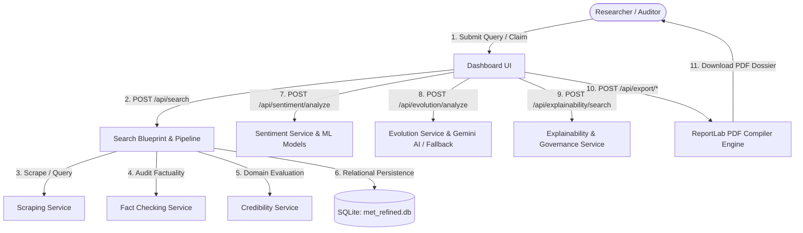

# 🌐 MET: Misinformation Detection & Evolution Tracking System

> **An enterprise-grade forensic research console to audit claim factuality, detect emotional manipulation, trace narrative mutation lineages across time, and provide Explainable AI (XAI) with tamper-evident PDF dossiers.**

[](https://www.python.org/)
[](https://flask.palletsprojects.com/)
[](https://scikit-learn.org/)
[](https://www.sqlite.org/)
[](https://tailwindcss.com/)
[](https://www.chartjs.org/)

---

## 📑 Table of Contents

1. [Project Overview & Abstract](#-project-overview--abstract)
2. [Why We Built This System](#-why-we-built-this-system)
3. [How It Is Different from Existing Systems](#-how-it-is-different-from-existing-systems)
4. [Core Advantages & Innovations](#-core-advantages--innovations)
5. [System Architecture & Workflow](#-system-architecture--workflow)
6. [Key Modules & Capabilities](#-key-modules--capabilities)
   - [Fact Verification & Claim Auditing](#1-fact-verification--claim-auditing)
   - [Sentiment Intelligence & Emotional Tone](#2-sentiment-intelligence--emotional-tone)
   - [Narrative Evolution & Mutation Lineage](#3-narrative-evolution--mutation-lineage)
   - [Explainable AI (XAI) & Model Governance](#4-explainable-ai-xai--model-governance)
   - [Source Credibility & Domain Trust](#5-source-credibility--domain-trust)
   - [Forensic PDF Research Dossiers](#6-forensic-pdf-research-dossiers)
7. [Developer Monitors & NLP Sandbox](#-developer-monitors--nlp-sandbox)
8. [Machine Learning Models & Training Pipeline](#-machine-learning-models--training-pipeline)
9. [Technology Stack & Rationale](#-technology-stack--rationale)
10. [Directory Structure](#-directory-structure)
11. [Installation & Getting Started](#-installation--getting-started)
12. [REST API Documentation](#-rest-api-documentation)
13. [Glossary of Technical Terms](#-glossary-of-technical-terms)
14. [Viva & Interview Cheat Sheet](#-viva--interview-cheat-sheet)

---

## 🔬 Project Overview & Abstract

In modern digital media, misinformation is not a static binary problem ("Real vs. Fake"). Instead, deceptive claims behave like biological viruses: they **mutate**, **rephrase**, **exploit emotional triggers**, and **migrate across news publications** over time to bypass automated keyword moderation filters.

The **MET (Misinformation Detection and Evolution Tracking)** platform addresses this challenge by providing an end-to-end investigative workbench for journalists, academic researchers, and regulatory auditors. Rather than providing an unexplained label, MET audits the factual accuracy of claims, tracks psychological emotional manipulation, reconstructs historical narrative lineages across timelines, and uses Explainable AI (XAI) to expose the exact lexical drivers behind its machine learning models.



---

## 🎯 Why We Built This System

- **Static Fact-Checking Fails**: Traditional fact-checkers verify a claim once. Days later, bad actors slightly modify the headline or omit key sentences, creating a new deceptive variant that goes unflagged.
- **Weaponized Emotional Tone**: Disinformation spreads six times faster than factual news because it is deliberately engineered to evoke intense visceral emotions (fear, indignation, panic). Standard tools overlook emotional tone completely.
- **The "Black Box" Trust Deficit**: Machine learning classifiers that output `Fake (94%)` without explanation cannot be used in court, academic journals, or newsrooms. Investigators need transparent feature weights.
- **Digital Evaporation**: Web pages, social posts, and headlines disappear or are stealth-edited. Researchers require tamper-evident, archivable forensic documentation with cryptographic proof.

---

## ⚖️ How It Is Different from Existing Systems

| Dimension | Manual Fact-Checkers (Snopes, PolitiFact) | Typical ML Binary Detectors | MET Research Platform (Our System) |
| :--- | :--- | :--- | :--- |
| **Analysis Scope** | Single manual review (slow, days to weeks) | Binary classification (`0` = Real, `1` = Fake) | **Multi-dimensional** (Factuality + Emotion + Lineage + XAI + Trust) |
| **Evolution Tracking** | None | None (classifies articles in isolation) | **Chronological mutation trees & Narrative Drift Score (0–100)** |
| **Emotional Tone** | Subjective commentary | Ignored | **6-class emotion distribution & Manipulation Risk Index** |
| **Explainability (XAI)**| Human editorial text | "Black Box" (unexplained probability) | **Token-level surrogate feature weights & Confidence Gauge** |
| **Source Reputation** | Addressed ad-hoc | Ignored | **Automated domain scoring with letter grades (A+ to F)** |
| **Reporting Output** | Webpage article only | Raw JSON terminal logs | **Cryptographically hashed PDF research dossiers (SHA-256)** |
| **Offline Resilience** | Requires active internet | Cloud API dependent | **Local heuristic fallbacks & serialized offline models** |

---

## 🚀 Core Advantages & Innovations

1. **Chronological Narrative Lineage**: Sorts gathered articles by publication timestamp, sets the earliest report as the Baseline Origin, and computes semantic vector cosine distances to track narrative drift over time.
2. **Algorithmic Transparency (XAI)**: Uses linear surrogate feature decomposition to highlight tokens supporting the prediction in emerald and contradicting tokens in rose.
3. **Dual-Model Benchmark Architecture**: Compares Logistic Regression against Multinomial Naive Bayes across three distinct NLP tasks (Fake News, Statement Credibility, and Emotion Recognition).
4. **Publisher Trust Normalization**: Normalizes URLs, strips tracking query parameters, evaluates domain authority, and assigns weighted letter grades (A+ to F).
5. **Relational Cascading Integrity**: Full foreign-key cascading guarantees that deleting a query automatically purges all child articles, sentiment records, mutation trees, and XAI logs without database bloat.
6. **Zero-Crash Resilient Design**: If external generative AI APIs (Gemini) are unavailable, internal rule-based template engines take over transparently.

---

## 🏛️ System Architecture & Workflow

```
+-------------------------------------------------------------------------+
|                              PRESENTATION LAYER                         |
|   HTML5  |  Tailwind CSS (Dark/Light Engine)  |  Vanilla JS  |  Chart.js|
+-------------------------------------------------------------------------+
                                    │ HTTP / REST + Bearer JWT
+-------------------------------------------------------------------------+
|                           APPLICATION GATEWAY                           |
|       Flask 3.0+ Application Factory  │  Flask-JWT-Extended Middleware  |
+-------------------------------------------------------------------------+
                                    │
+-------------------------------------------------------------------------+
|                              SERVICE LAYER                              |
| SearchService │ FactCheckingService │ SentimentService │ EvolutionService|
| ExplainabilityService │ CredibilityService │ ScrapingService │ ExportService|
+-------------------------------------------------------------------------+
            │                                           │
+-----------------------+                   +-----------------------------+
|    ML / NLP ENGINE    |                   |       PERSISTENCE LAYER     |
| Scikit-Learn │ NLTK   |                   |  SQLite 3 (met_refined.db)  |
| spaCy │ Joblib        |                   |  SQLAlchemy Relational ORM  |
| Gemini Generative AI  |                   |  ReportLab / PDF Engine     |
+-----------------------+                   +-----------------------------+
```

### End-to-End Sequence Lifecycle
1. **User submits query** (e.g. `"COVID vaccine infertility"` or `"5G causes cancer"`) on the Dashboard.
2. **Flask Gateway** validates input and creates a `SearchHistory` record with `status='pending'`.
3. **ScrapingService** retrieves relevant articles from local cache and web feeds, associating them via scoped `(search_id, url)` unique constraints.
4. **FactCheckingService** cross-references claim parameters to produce a veracity rating (`VERIFIED CLAIM` or `MISINFORMATION DETECTED`).
5. **CredibilityService** assesses all publisher domains, calculates historical trust scores, and assigns letter grades.
6. **SentimentService** executes TF-IDF vectorization and Logistic Regression inference to calculate probability strengths for 6 emotional markers.
7. **EvolutionService** sorts articles chronologically, sets the baseline, calculates Cosine Distance, and tags narrative mutation points.
8. **ExplainabilityService** computes local surrogate linear feature weights (LIME/SHAP logic) and evaluates confidence levels.
9. **ExportService** compiles formal, multi-page vector PDF research dossiers with SHA-256 checksums and initiates direct download.

---

## 🧩 Key Modules & Capabilities

### 1. Fact Verification & Claim Auditing
- Audits claim statements against verified historical parameters.
- Outputs clear veracity ratings: **`VERIFIED CLAIM`** (emerald) or **`MISINFORMATION DETECTED`** (rose).
- Computes aggregate metrics: total articles collected, distinct sources used, average source credibility grade, and processing latency.

### 2. Sentiment Intelligence & Emotional Tone
- Quantifies emotional manipulation patterns used to engineer social virality.
- **Dominant Emotion**: Identifies the primary emotional vector (Joy, Fear, Anger, Sadness, Love, Surprise).
- **Manipulation Risk Index**: Evaluates manipulation severity:
  - `LOW` (Emerald): Factual, measured reporting.
  - `MEDIUM` (Amber): Sensationalist adjectives or persuasive language.
  - `HIGH` (Rose): Deceptive emotional triggers designed to prompt uncritical sharing.
- **Emotion Distribution Bar Chart**: Interactive Chart.js visualization displaying exact probability strengths.

### 3. Narrative Evolution & Mutation Lineage
- Models the temporal progression of a news story across its publishing lifecycle.
- **Narrative Drift Score (0 to 100)**:
  - `STABLE` (≤ 20.0): Consistent claim facts and phrasing.
  - `MODERATE DRIFT` (20.1 – 50.0): Minor rephrasings or variant headlines.
  - `MUTATED` (> 50.0): Significant semantic distortion, omitted facts, or exaggerated claims.
- **Emerging Themes**: Extracts high-frequency keyword pills.
- **Lineage Timeline**: Step-by-step visual chain displaying chronological progression, similarity to baseline percentage, cluster variants, and **Mutation Warning Tags** (`⚠️ Narrative Mutation`).

### 4. Explainable AI (XAI) & Model Governance
- Opens the machine learning black box for auditability and judicial/editorial review.
- **Confidence Gauge**: Semi-doughnut gauge rating model confidence (`HIGH`, `MODERATE`, `LOW`).
- **Feature Importance Bar Chart**:
  - **Emerald Bars**: Words that *support* the prediction.
  - **Rose Bars**: Words that *contradict* the prediction.
- **Evidence Corroboration**: Cards showing verified citations vs. debunking counter-evidence snippets.
- **Model Governance Registry**: Tracks Model Name, Version (`v2.4.1`), Vectorizer Version, Pipeline Version, Inference Mode (`MODEL` / `HEURISTIC`), and Execution Latency.

### 5. Source Credibility & Domain Trust
- Normalizes web URLs to base domains (strips subdomains and tracking query strings).
- Grades publishers on a standard academic scale (**A+**, **A**, **B**, **C**, **D**, **F**).
- Maintains historical evaluation logs and rolling trust averages.

### 6. Forensic PDF Research Dossiers
- Compiles publication-ready vector PDF documents via ReportLab.
- **Available Dossier Types**: Fact Audit Report, Sentiment Analysis Report, Narrative Evolution Report, XAI Governance Audit, and Comprehensive Master Dossier.
- **Security Features**:
  - **Cryptographic SHA-256 Checksum**: Embedded in report metadata and verified prior to download.
  - **Rate Limiting**: 1 export per 5 seconds per user (`429 Too Many Requests`) to prevent denial-of-service.
  - **Self-Healing Storage**: Automatically regenerates missing PDF files from database snapshots on demand.

---

## 📊 Developer Monitors & NLP Sandbox

Located at `/system-overview`:

- **Real-Time System Monitors**: Live status pings for API Gateway (Online), SQLite DB (Connected), and NLP Engine (Active).
- **Interactive NLP Preprocessing Sandbox**: Real-time test console allowing developers to enter dirty text with HTML tags, emojis, and punctuation to test regex cleaning, stopword removal, and lemmatization (`POST /api/nlp/preprocess`).
- **Dataset Distribution Analytics**:
  - Fake News Distribution (Doughnut Chart: Real vs. Fake).
  - LIAR Claim Credibility (Bar Chart: True vs. Partially True vs. False).
  - Emotion Recognition (Horizontal Bar Chart: 6 emotion classes).
- **Model Benchmarking Table**: Live comparison of Logistic Regression vs. Naive Bayes across Accuracy, Precision, Recall, and F1-Score with an indigo **"BEST"** badge.
- **Live Dataset Previews**: Tabbed inspection of raw dataset samples with ground-truth labels.
- **Operational Logger**: Real-time feed from `logs/application.log`.

---

## 🤖 Machine Learning Models & Training Pipeline

Trained via **[scripts/train_models.py](file:///c:/Users/laksh/workspace/Projects/Major%20project/MET/scripts/train_models.py)** using an 80/20 stratified split (`test_size=0.2, random_state=42`).

### 1. Training Datasets
- **Fake News Detection Dataset**: `44,898 articles` (`Fake.csv` & `True.csv`).
- **LIAR Benchmark Dataset**: `12,791 PolitiFact claims` mapped into 3 veracity classes.
- **Emotion Recognition Dataset**: `20,000 utterances` across 6 emotional tones.

### 2. Preprocessing & Vectorization
- Lowercase normalization, regex stripping (URLs, HTML, mentions), punctuation removal, NLTK stopword filtering, and lemmatization.
- **TF-IDF Vectorization**: `max_features=5000`, `ngram_range=(1, 2)` (captures unigrams and bigrams).

### 3. Empirical Benchmark Results

| Task Name | Model Algorithm | Accuracy | Weighted Precision | Weighted Recall | Weighted F1-Score | Status |
| :--- | :--- | :--- | :--- | :--- | :--- | :--- |
| **Fake News Detection** | **Logistic Regression** | **98.94%** | **98.94%** | **98.94%** | **98.94%** | 🏆 **Best** |
| Fake News Detection | Multinomial Naive Bayes | 94.66% | 94.66% | 94.66% | 94.66% | Baseline |
| **LIAR Claim Veracity** | **Logistic Regression** | **55.26%** | **48.96%** | **55.26%** | **48.64%** | 🏆 **Best** |
| LIAR Claim Veracity | Multinomial Naive Bayes | 57.21% | 47.70% | 57.21% | 45.87% | Baseline |
| **Emotion Recognition** | **Logistic Regression** | **87.35%** | **87.53%** | **87.35%** | **86.82%** | 🏆 **Best** |
| Emotion Recognition | Multinomial Naive Bayes | 79.55% | 82.94% | 79.55% | 77.16% | Baseline |

*Trained weights are serialized using Joblib into `models/` for sub-20ms runtime inference.*

---

## 🛠️ Technology Stack & Rationale

| Layer | Technology | Justification / Rationale |
| :--- | :--- | :--- |
| **Language** | Python 3.12 | Native ecosystem for NLP, machine learning, and web development. |
| **Backend Framework** | Flask 3.0.2 | Lightweight, synchronous execution avoiding async blocking with CPU-bound Scikit-Learn models. |
| **Database** | SQLite 3 + SQLAlchemy | Zero-daemon portable setup, relational cascading deletes, and seamless production migration path. |
| **Authentication** | Flask-JWT-Extended | Stateless Bearer token security with salted scrypt password hashing. |
| **Frontend UI** | HTML5 + Tailwind CSS | Responsive glassmorphic interface with zero Node.js build-step brittleness. |
| **Visualizations** | Chart.js 4.4 | High-performance interactive client-side charts with instant canvas redrawing. |
| **PDF Compilation** | ReportLab 4.2.2 | Compiles vector PDF documents with cryptographic checksums for forensic validity. |

---

## 📁 Directory Structure

```
MET/
├── app/                              # Core Application Package
│   ├── __init__.py                   # Application Factory (create_app), extensions, logging
│   ├── config.py                     # Configuration settings (Database URI, JWT secret, Paths)
│   ├── extensions.py                 # Instantiated db, migrate, and jwt objects
│   ├── blueprints/                   # 14 REST API & Page Controllers
│   ├── models/                       # SQLAlchemy Database Entities (Relational Models)
│   ├── services/                     # Business Logic, NLP & Scientific Services
│   ├── static/                       # Custom CSS, animations, and global JS engine
│   └── templates/                    # Jinja2 HTML5 UI Templates
├── instance/                         # Local database (met_refined.db) & compiled PDF exports
├── models/                           # Serialized Joblib model weights & benchmark metrics
├── scripts/                          # Model training and regression verification test suites
├── app.py                            # Development server entry point
├── requirements.txt                  # Python package dependencies
├── PROJECT_COMPONENT_GUIDE.md        # Comprehensive technical & viva reference guide
└── README.md                         # This file
```

---

## ⚡ Installation & Getting Started

### 1. Prerequisites
- Python 3.12 or higher installed.
- Git installed.

### 2. Clone Repository & Setup Virtual Environment
```bash
# Clone the repository
git clone https://github.com/LizBopaiah/Misinformation-Evolution-Tracking-System.git
cd Misinformation-Evolution-Tracking-System

# Create virtual environment
python -m venv venv

# Activate virtual environment
# On Windows (PowerShell):
.\venv\Scripts\Activate.ps1
# On Linux / macOS:
source venv/bin/activate
```

### 3. Install Dependencies
```bash
pip install -r requirements.txt
python -m spacy download en_core_web_sm
```

### 4. Initialize Database & Seed Demo Data
```bash
# Seeds pre-audited search topics, users, and baseline domains
python scripts/seed_demo_data.py
```

### 5. Run the Application
```bash
python app.py
```
*Open your browser and navigate to: **`http://127.0.0.1:8000`***

### 6. Default Demonstration Credentials
- **Email**: `researcher_test@example.com`
- **Password**: `Password123!`

---

## 📡 REST API Documentation

| Method | Endpoint | Description | Protected |
| :--- | :--- | :--- | :---: |
| `POST` | `/api/auth/register` | Register new researcher account | No |
| `POST` | `/api/auth/login` | Login and receive Bearer JWT | No |
| `POST` | `/api/auth/logout` | Revoke session | Yes |
| `GET` | `/api/users/profile` | Fetch user profile & timestamps | Yes |
| `PUT` | `/api/users/profile` | Update user name / password | Yes |
| `POST` | `/api/users/profile-picture` | Upload profile avatar (PNG/JPG/WEBP) | Yes |
| `GET` | `/api/users/search-history` | Fetch historical query ledger | Yes |
| `POST` | `/api/search` | Execute live claim query & scraping | Yes |
| `GET` | `/api/search/<id>` | Load historical query & cached results | Yes |
| `POST` | `/api/sentiment/analyze` | Compute 6-emotion tones & risk index | Yes |
| `POST` | `/api/evolution/analyze` | Trace narrative mutations & drift score | Yes |
| `POST` | `/api/explainability/search` | Compute XAI feature weights & confidence | Yes |
| `POST` | `/api/export/dossier` | Compile forensic master PDF dossier | Yes |
| `GET` | `/api/export/<id>/<filename>` | Secure PDF stream download | Yes |
| `GET` | `/api/datasets/status` | Dataset counts & health check | No |
| `GET` | `/api/models/performance` | Model benchmarking metrics | No |
| `POST` | `/api/nlp/preprocess` | Interactive text tokenizer sandbox | No |

---

## 📖 Glossary of Technical Terms

- **TF-IDF (Term Frequency - Inverse Document Frequency)**: A statistical measure that evaluates how relevant a word is to a document in a collection. Rare, informative words receive high scores, while generic stopwords receive near-zero scores.
- **Cosine Similarity**: A metric that measures the cosine of the angle between two multi-dimensional text vectors, scoring semantic similarity from `0.0` (completely different) to `1.0` (identical).
- **Narrative Drift**: A normalized score (0 to 100) measuring how far a news claim has mutated from its earliest verified baseline report.
- **Explainable AI (XAI)**: Methods and techniques that allow human investigators to comprehend and trust the results and output created by machine learning algorithms.
- **JWT (JSON Web Token)**: A compact, URL-safe means of representing claims securely between two parties for stateless authorization.
- **SHA-256 Checksum**: A 256-bit cryptographic hash that serves as a tamper-evident digital fingerprint for verifying document integrity.

---

## 🎓 Viva & Interview Cheat Sheet

### Common Viva Questions & Winning Responses

**Q1: What is the primary novelty of this major project?**  
> *"Most existing tools treat misinformation as a static binary classification problem. Our system models misinformation as a living narrative that mutates over time across publishers, analyzes emotional manipulation tactics, calculates narrative drift, and provides Explainable AI (XAI) feature weights so investigators know exactly why a claim was flagged."*

**Q2: How does the narrative evolution algorithm work?**  
> *"We sort all gathered articles chronologically. The earliest verified report is set as the Baseline Origin. We vectorize all articles using TF-IDF and calculate the Cosine Distance of each subsequent report against the baseline. When similarity drops significantly or linguistic exaggeration spikes, our algorithm records a Mutation Point. The cumulative distance over time is normalized into our Narrative Drift Score (0 to 100)."*

**Q3: Why did Logistic Regression outperform Naive Bayes?**  
> *"Naive Bayes assumes conditional independence between words, which is violated in natural language where word order and context matter. Logistic Regression optimizes cross-entropy loss over continuous linear weights, better capturing complex token relationships and enabling direct surrogate feature importance extraction for Explainable AI (XAI)."*

**Q4: How does the system handle missing APIs or offline environments?**  
> *"The platform implements a resilient fallback design. If external APIs (like Gemini) are unreachable, the system automatically falls back to internal rule-based heuristic templates. Serialized Scikit-Learn models and datasets operate locally, ensuring zero-crash operation."*

---

## 📄 License & Academic Declaration

This project is developed as an academic Major Project for misinformation research, narrative lineage tracking, and algorithmic transparency.

**Developers**: MET Research Platform Team  
**License**: MIT License  
**Academic Year**: 2025–2026
